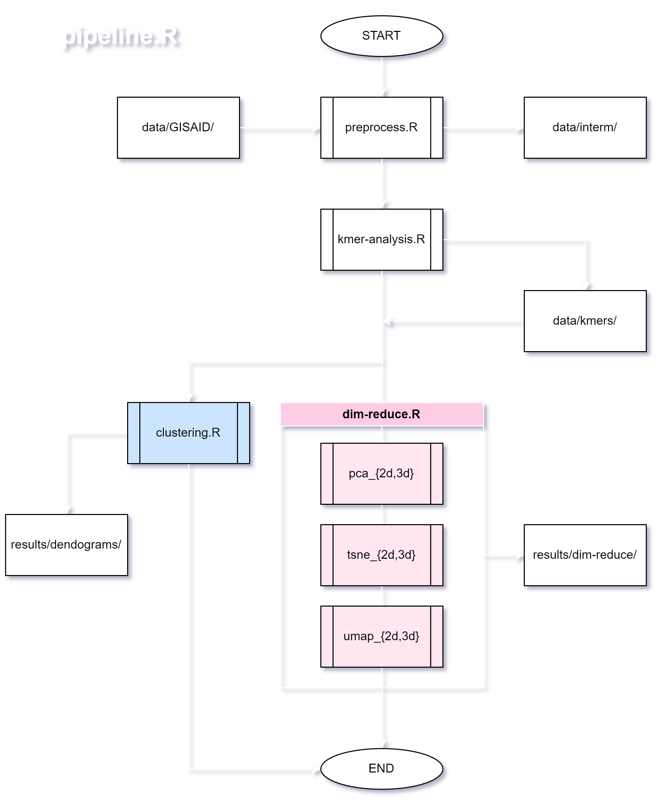

# pgc-perf-opt

**Performance Evaluation and Optimization of an Unsupervised Machine Learning Pipeline for Discriminating Major SARS-CoV-2 Variants in the Philippines**

A highly scaleable unsupervised machine learning (UML) pipeline for discriminating major SARS-CoV-2 variants in the Philippines. Also includes performance benchmarks of said workflow according to the applied linear algebra library backend and processor vulnerability mitigations.

**Research Objectives:**

1. Create an improved UML variant discriminator pipeline that can work on any raw GISAID input, especially for Philippines SARS-CoV-2 data, with enhanced usability, efficiency, and scalability.
2. Understand the impact of an optimized linear algebra library backend on the UML bioinformatics workflow.
3. Understand the impact of processor vulnerability mitigations on the UML bioinformatics workflow.

## Data

This section describes the characteristics of the data such as sources, sizes, and formats, motivating the approach to data wrangling and downstream analysis. Different data configurations may also be used in different benchmarks.

The findings of this study are based on FASTA data and metadata associated with **24,004 sequences** sampled over **January 3, 2021 to May 30, 2023**. Current parameters select for the major variants Alpha, Beta, Delta, Gamma,  Omicron (BA.\*, XBC.\*, CM.\*), and Omicron Subvariants (XBB.\*, BL.\*, BN.\*, FL.\*). Stratified random sampling is applied to trim the dataset due to performance limitations, and indeed scaling up to all 24,004 sequences is an ongoing objective.

The variant attribute is assigned via the file names produced by the GISAID database's filters. Similarly, the distinction between the main Omicron variant lineages and the Omicron Subvariants' lineages were derived from how GISAID labelled the samples and their files. Ambiguous variant assignments were also sanitized. For instance, the XBB.9 lineage were lumped under both Omicron and Omicron Subvariant. Because most of the XBB.9 samples were already under Omicron Subvariant, all Omicron XBB.9 samples were transferred to Omicron Subvariant. Unassigned samples were also pruned, among many other data sanitation steps.

The data is available on GISAID up to June 30, 2023, via the EPI_SET identifier [gisaid.org/EPI_SET_230813qo](https://gisaid.org/EPI_SET_230813qo) and also accessible at [doi.org/10.55876/gis8.230813qo](https://doi.org/10.55876/gis8.230813qo). Moreover, a complete list of Accession Numbers can be found in [`data/overview/accession.txt`](data/overview/accession.txt). The unaltered [Supplemental Table](data/gisaid_supplemental_table_epi_set_230813qo.pdf) may also be consulted manuscript for further details.

### On Sharing and Using GISAID Data
For data obtained from GISAID, only the **accession numbers** are referenced in this remote repository instead of the actual dataset. GISAID (2012) gives the following reason:

> GISAID does not promote the release of data to databases where access to data is anonymous and the rights of the submitter are relinquished.  GISAID already provides the public with open access to data in a transparent way.

Please see `data/README.md` for further instructions.

## Code
This section contains the code for the variant discriminator workflow as outlined by the following flowchart (best viewed in dark mode):

Raw GISIAD data is placed in `data/GISAID`. The source `code` then does the following:
- Data extraction, wrangling, sanitation, overview compilation, and augmentation of `data/GISAID`.
- k-mer counting which produces augmented k-mer, metadata, and heatmap files in `data/kmers` and `data/overview`.
- UML dimensionality reduction and clustering techniques, the results of which are stored in `results` and presented in `presentations`.

Pilot code may also be written for more novel workflows. For instance, see [this](https://www.frontiersin.org/articles/10.3389/fbioe.2015.00035/full) wheat mutation analysis article.

## Results
This section will summarize the performance evaluations of each benchamrk. Possibly, results from novel bioinformatics workflows or benchmark approaches may also be discussed here.

## Benchmarks
Relevant hardware, software, and data configurations must be explicitly noted for each benchmark.

## Presentations
This section will contain directories for the research proposal presentations, research updates and the final research presentation.

---
## Acknowledgements
We gratefully acknowledge all data contributors, i.e., the Authors and their Originating laboratories responsible for obtaining the specimens, and their Submitting laboratories for generating the genetic sequence and metadata and sharing via the **GISAID Initiative**, on which this research is based.

Sanitized author and submitting laboratories metadata, with some variant related parameters, may also be found in [`data/overview/authors.csv`](`data/overview/authors.csv`) and [`data/overview/labs.csv`](`data/overview/labs.csv`) respectively.

## GISAID Initiative Data
The EPI_SET ID hyperlink below only works for those with GISAID credentials. Those without GISAID Access Credentials may retrieve information about all contributors of data on which the analysis is based by either clicking on the DOI, or pasting the EPI_SET ID in the "Data Acknowledgement Locator" on the GISAID homepage.

- EPI_SET ID: EPI_SET_230813qo (<https://gisaid.org/EPI_SET_230813qo>)
- DOI: <https://doi.org/10.55876/gis8.230813qo>

## References
Chandra, R., Bansal, C., Kang, M., Blau, T., Agarwal, V., Singh, P., Wilson, L. O. W., & Vasan, S. (2023). Unsupervised machine learning framework for discriminating major variants of concern during COVID-19. *PLOS ONE, 18(5),* e0285719. https://doi.org/10.1371/journal.pone.0285719. Reference repository at [ai-covariants/analysis-mutations](https://github.com/ai-covariants/analysis-mutations).

GISAID. (2012). *FAQ.* https://gisaid.org/help/faq/

Kessler, N., Bonte, A., Albaum, S. P., Mäder, P., Messmer, M., Goesmann, A., Niehaus, K., Langenkämper, G., & Nattkemper, T. W. (2015). Learning to Classify Organic and Conventional Wheat – A Machine Learning Driven Approach Using the MeltDB 2.0 Metabolomics Analysis Platform. *Frontiers in Bioengineering and Biotechnology, 3.* https://www.frontiersin.org/articles/10.3389/fbioe.2015.00035
