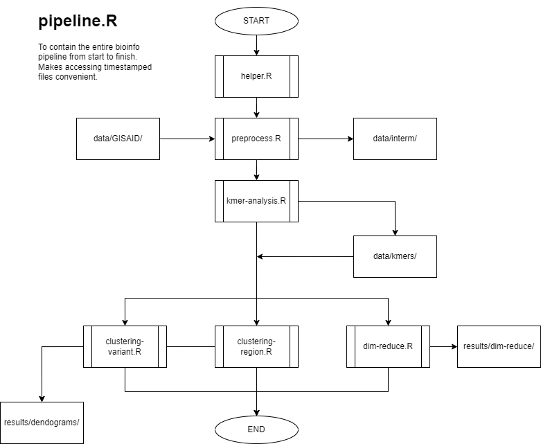

# pgc-perf-opt
A project to benchmark the performance of an unsupervised machine learning bioinformatic workflows according to the status of Spectre/Meltdown patches and the choice of linear algebra libraries.

## Data
This section will describe characteristics of the data such as sources, size, and format. These will motivate the upcoming data importation, sanitation, visualization, and analysis. Different data configurations may also be used in different benchmarks.

### On GISAID Data
For data obtained from GISAID, only **accession numbers** must be referenced. Do not release the actual datasets. GISAID (2012) gives the following reason:

> GISAID does not promote the release of data to databases where access to data is anonymous and the rights of the submitter are relinquished.  GISAID already provides the public with open access to data in a transparent way.

Please see `data/README.md` for further instructions.

## Workflows
This section will describe the collected bioinformatics workflows. Currently, only the code from the reference repository will be benchmarked for the prototype benchmark workflow.

Said workflow found in `code/pipeline-classic.R` has the following structure:

## Code
This section will explain the code used for running the workflows and the benchmarks. Relevant hardware, software, and data configurations must be explicitly noted for each benchmark.

Pilot code may also be written for more novel workflows. For instance, see [this](https://www.frontiersin.org/articles/10.3389/fbioe.2015.00035/full) wheat mutation analysis article.

## Results
This section will summarize the performance evaluations of each benchamrk. Possibly, results from novel bioinformatics workflows or benchmark approaches may also be discussed here.

## Presentations
This section will contain directories for the research proposal presentations, research updates and the final research presentation.

## Custom Plotting
Factor1 = variant
Factor2 = div
filterf1 <- (“omicron” “omicron_sub”)
Filterf2 <- (“all regions from luzon”)

Filter_pca <- (pca_df, data, k, filterf1, filterf2),

 pca_plot <- function(pca_df, data, k, color=factor1, filterf1, shape=factor2, filterf2)

Filtertsne
tsneplot

Filterumap
Umap plot

---
## References
Chandra, R., Bansal, C., Kang, M., Blau, T., Agarwal, V., Singh, P., Wilson, L. O. W., & Vasan, S. (2023). Unsupervised machine learning framework for discriminating major variants of concern during COVID-19. *PLOS ONE, 18(5),* e0285719. https://doi.org/10.1371/journal.pone.0285719. Reference repository at [ai-covariants/analysis-mutations](https://github.com/ai-covariants/analysis-mutations).

GISAID. (2012). *FAQ.* https://gisaid.org/help/faq/

Kessler, N., Bonte, A., Albaum, S. P., Mäder, P., Messmer, M., Goesmann, A., Niehaus, K., Langenkämper, G., & Nattkemper, T. W. (2015). Learning to Classify Organic and Conventional Wheat – A Machine Learning Driven Approach Using the MeltDB 2.0 Metabolomics Analysis Platform. *Frontiers in Bioengineering and Biotechnology, 3.* https://www.frontiersin.org/articles/10.3389/fbioe.2015.00035
